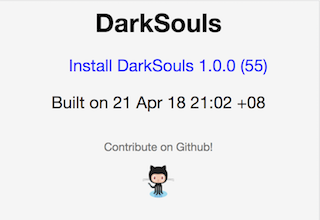
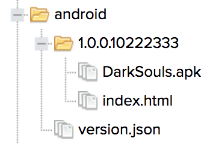
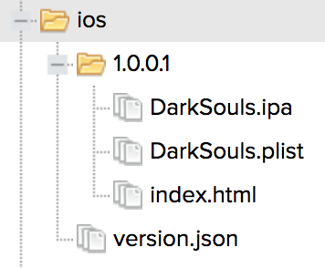

# GOTA

[](https://goreportcard.com/report/github.com/bzon/gota)
[](https://godoc.org/github.com/bzon/gota)
[](https://github.com/bzon/gota/releases/)

Automate the beta testing distribution of your Android and iOS application files with gota.

Gota is a [Golang](http://golang.org/) powered Over the Air Installation site creation tool.



## Feature Checklist

* [x] Upload and generate site to a Nexus 3 Site Repository
* [ ] Upload and generate site to a Nexus 2 Site Repository (untested)
* [ ] Upload and generate site to an Amazon S3 bucket

## Installation

Get the executable binary for your platform from the [Release Page](https://github.com/bzon/gota/releases/).

## Commands Guide

Gota command help `gota --help`

Nexus command help `gota nexus --help`

### Nexus APK Upload

Upload an APK file to a Nexus Site Repository

```bash
./gota nexus --nexusHost http://localhost:8081 \
            --nexusRepo site \
            --nexusUser admin \
            --nexusPassword admin123 \
            --destDir android \
            --srcFile pkg/resources/DarkSouls.apk \

file uploaded: http://localhost:8081/repository/site/nexus_android_repo/1.0.0/10222333/appicon.png
file uploaded: http://localhost:8081/repository/site/nexus_android_repo/version.json
file uploaded: http://localhost:8081/repository/site/nexus_android_repo/1.0.0/10222333/index.html
file uploaded: http://localhost:8081/repository/site/nexus_android_repo/1.0.0/10222333/DarkSouls.apk
```

Access the index.html file url from your Android device!

Uploaded site structure



### Nexus IPA Upload

Upload an IPA file to a Nexus Site Repository

```bash
./gota nexus --nexusHost http://localhost:8081 \
            --nexusRepo site \
            --nexusUser admin \
            --nexusPassword admin123 \
            --destDir ios \
            --srcFile pkg/resources/DarkSouls.ipa \

file uploaded: http://localhost:8081/repository/site/nexus_ios_repo/1.0.0/4/appicon.png
file uploaded: http://localhost:8081/repository/site/nexus_ios_repo/version.json
file uploaded: http://localhost:8081/repository/site/nexus_ios_repo/1.0.0/4/index.html
file uploaded: http://localhost:8081/repository/site/nexus_ios_repo/1.0.0/4/DarkSouls.ipa
file uploaded: http://localhost:8081/repository/site/nexus_ios_repo/1.0.0/4/app.plist
```

Access the index.html file url from your iPhone device!

Uploaded site structure



## Development Setup

### Build and Test

```bash
go get -v ./...
go test -v ./...
```

If you are on Windows, ensure to go get spf13/cobra's dependency for it. 

```bash
GOOS=windows go get -v -u github.com/spf13/cobra
go get -v ./...
go test -v ./...
```

### Nexus Feature Test

You must have a Nexus 3 server running in your machine. 

Get it easily via docker command: `docker run -d -p 8081:8081 --name nexus3`.

Then, create a Raw Repository with a repository id `site`.

### S3 Feature Test

WIP

## Inspirations and References

* [Fastlane Nexus Upload](https://docs.fastlane.tools/actions/nexus_upload/)
* [Fastlane S3 Plugin](https://github.com/joshdholtz/fastlane-plugin-s3/)
* [Creating an Installation Link for your enterprise App](https://support.magplus.com/hc/en-us/articles/203808598-iOS-Creating-an-Installation-Link-for-Your-Enterprise-App)
