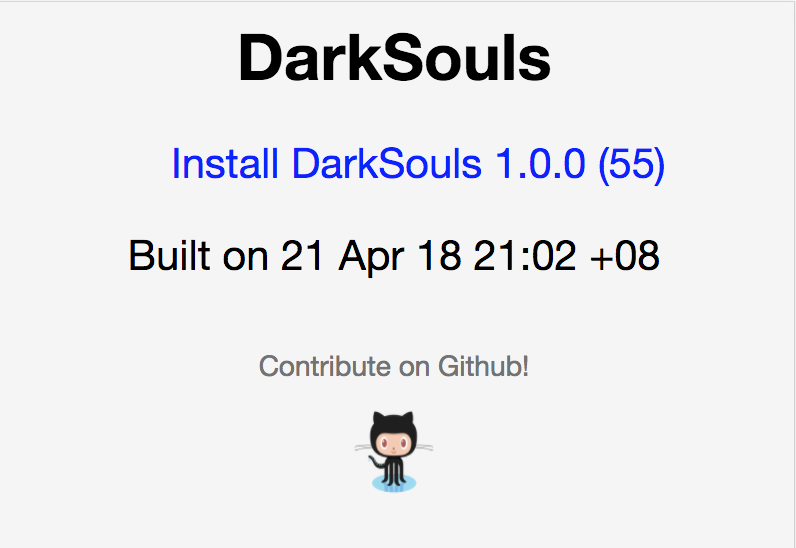

[](https://forthebadge.com)

# GOTA

[Go](http://golang.org/) Over the Air installation for Android APK and iOS Ipa files!



## Feature Checklist

* [ ] Upload and generate site to a Nexus 3 Site Repository
* [ ] Upload and generate site to a Nexus 2 Site Repository
* [ ] Upload and generate site to an Amazon S3 bucket

## User Guide

Upload to a Nexus(3) Site Repository

```bash
gota nexus -srcFile /tmp/DarkSouls.ipa \
    -bundleVersion 1.0.0 \
    -buildNumber 55 \
    -destDir ios_ota \
    -nexusRepo site \
    -nexusUser admin \
    -nexusPassword admin123 \
    -nexusHost http://localhost:8081
```

Upload to an Amazon S3 Bucket

```bash
gota s3 -srcFile /tmp/DarkSouls.ipa \
    -bundleVersion 1.0.0 \
    -buildNumber 55 \
    -destDir ios_ota \
    -s3Bucket examplebucket \
    -s3ApiKey xxxxx \
    -s3ApiSecretKey xxxxx \
    -s3Region xxxx
```

## Development

```bash
go test -v ./...
```

## Inspirations and References

* [Fastlane Nexus Upload](https://docs.fastlane.tools/actions/nexus_upload/)
* [Fastlane S3 Plugin](https://github.com/joshdholtz/fastlane-plugin-s3/)
* [Creating an Installation Link for your enterprise App](https://support.magplus.com/hc/en-us/articles/203808598-iOS-Creating-an-Installation-Link-for-Your-Enterprise-App)
