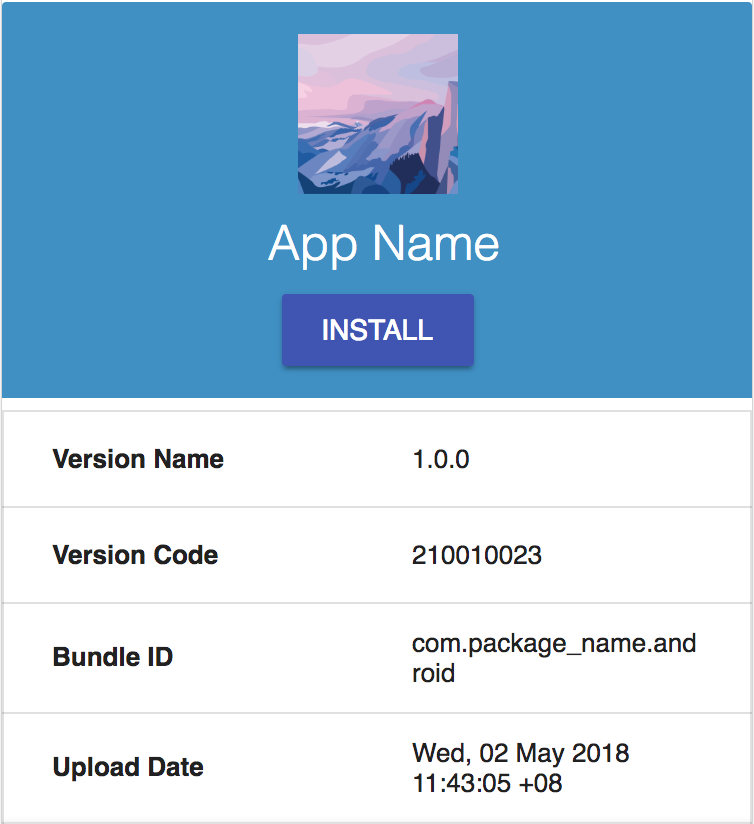

# About gota

[](https://goreportcard.com/report/github.com/bzon/gota)
[](https://godoc.org/github.com/bzon/gota)
[](https://github.com/bzon/gota/releases/)
[](https://github.com/bzon/gota/releases/)

Automate the beta testing distribution of your Android and iOS application files.

__gota__ is a just command line tool that you can easily integrate in your current continuous integration workflow with tools such as Fastlane.


__gota__ automatically detects the build information of your ipa or apk files and creates an OTA (over the air) installation site that is uploaded to your desired hosting server.

|Android						  |iOS							  |
|---------------------------------|-------------------------------|
|||

## Supported Static Hosting Service

* [x] Amazon S3 Bucket
* [x] Nexus 3 Site Repository
* [ ] DigitalOcean Spaces 
* [ ] Standalone Gota Server
* [ ] Nexus 2 Site Repository

## Getting Started

### Installation

Get the executable binary for your platform from the [Release Page](https://github.com/bzon/gota/releases/).

```bash
# downloading via wget
wget https://github.com/bzon/gota/releases/download/0.1.4/gota-linux-amd64
# symlink
ln -sv gota-linux-amd64 /usr/bin/gota

# test gota
gota --version
# command output
gota version v0.1.4 darwin/amd64
```

Currently, Linux, macOS and Windows are supported.

If you have Go installed, just run `go get github.com/bzon/gota`.

### Help Flags

To see the required flags, use the --help flag.

```bash
gota --help
gota nexus --help
gota s3 --help
```

### Uploading to S3 Bucket

Set the AWS API key securely.

```bash
export AWS_ACCESS_KEY=xxxxx
export AWS_SECRET_ACCESS_KEY=xxxxx
```

Command input:

```bash
gota s3 --bucket example-s3-bucket --srcFile sample.ipa --destDir ios_bucket
```

Command output:

```bash
2018/04/30 01:12:37 file uploaded: https://example-s3-bucket.s3.amazonaws.com/ios_bucket/1.0.0/4/appicon.png
2018/04/30 01:12:37 file uploaded: https://example-s3-bucket.s3.amazonaws.com/ios_bucket/1.0.0/version.json
2018/04/30 01:12:37 file uploaded: https://example-s3-bucket.s3.amazonaws.com/ios_bucket/1.0.0/4/index.html
2018/04/30 01:12:37 file uploaded: https://example-s3-bucket.s3.amazonaws.com/ios_bucket/1.0.0/4/sample.ipa
2018/04/30 01:12:37 file uploaded: https://example-s3-bucket.s3.amazonaws.com/ios_bucket/1.0.0/4/app.plist
```

__NOTE__:

Currently, gota assigns an AES256 encryption and a public-read ACL to all files that are uploaded. This may change to be configurable in the future.

### Uploading to Nexus

The repository must be a [Raw Site Repository](https://help.sonatype.com/repomanager3/raw-repositories-and-maven-sites).

Set the Nexus credentials securely.

```bash
# set the nexus credentials
# this can also be set via command flags
export NEXUS_USER=admin
export NEXUS_PASSWORD=admin123
```

Command input:

```bash
gota nexus --nexusHost http://localhost:8081 \
            --nexusRepo site \
            --destDir nexus_android_repo \
            --srcFile build/outpus/apk/sample.apk
```

Command output:

```bash
file uploaded: http://localhost:8081/repository/site/nexus_android_repo/1.0.0/10222333/appicon.png
file uploaded: http://localhost:8081/repository/site/nexus_android_repo/1.0.0/version.json
file uploaded: http://localhost:8081/repository/site/nexus_android_repo/1.0.0/10222333/index.html
file uploaded: http://localhost:8081/repository/site/nexus_android_repo/1.0.0/10222333/sample.apk
```

__NOTE__:

Currently supports only Nexus 3.

### Extra Features

__gota__ creates a `gotalink.txt` and `ipalink.txt` (if uploading an ipa) that contains the url or direct download link. If you are using a CI server, you can have it read these files for quickly getting the url that you can send to your team.

### Site Directory Layout

```bash
destDir
\__(ipa CFBundleShortVersion or apk versionName)
   \__version.json
   \__(ipa CFBundleVersion or apk versionCode)
	 \__appicon.png
	 \__(ipa or apk file)
	 \__app.plist (if ipa file)
	 \__index.html
```

## Developers

If you are on Windows, ensure to go get spf13/cobra's dependency for it.

```bash
GOOS=windows go get -v -u github.com/spf13/cobra
go get -v ./...
go test -v ./...
```

### Testing S3 Feature

Set these environment variables before running `go test` in s3 package.

```bash
AWS_ACCESS_KEY=xxxxx
AWS_SECRET_ACCESS_KEY=xxxxx
GOTEST_AWS_BUCKET=example-bucket
```

### Testing Nexus Feature

You must have a Nexus 3 server running in your machine.

Get it easily via docker command: `docker run -d -p 8081:8081 --name nexus3`.

Then, create a Raw Repository with a repository id `site`.

## Motivation

* [Fastlane Nexus Upload](https://docs.fastlane.tools/actions/nexus_upload/)
* [Fastlane S3 Plugin](https://github.com/joshdholtz/fastlane-plugin-s3/)
* [Creating an Installation Link for your enterprise App](https://support.magplus.com/hc/en-us/articles/203808598-iOS-Creating-an-Installation-Link-for-Your-Enterprise-App)
